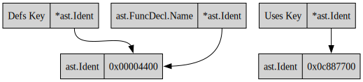

## ast.FuncDecl

#### Connect Defs Map To FuncDecl



#### position matching (TLDR)

`my_funcdecl.Name.Pos()` seems to match the `value.Pos()` of the `Uses` types map.

#### .Pos()

```
|
V
func main() {
...
```

#### .End()

The `End()` position is at the character after the closing squirly bracket.

```
func main() {
    ...
}
 ^
 |
```

#### .Name.Pos()


```
     |
     V
func main() {
...
```

#### .Name.End()

`.Name.End()` points to the opening parenthesis:
```
         |
         V
func main() {
...
```

#### .Type.End()

```
           |
           V
func main() {
...
```
