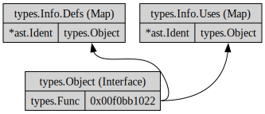

# types.Info (struct)

## overview



## types.Info.Uses Map

#### General Map Overview

Definition:
```
Uses map[*ast.Ident]Object
```
(`Object` is `types.Object`)

Put simply, the `Uses` map has the function call as a key (first part) and \
the function definition in the value (second part) of the map.
```
Key: cli_args (cli_args.go:11:13)	Value: type main.cli_args struct{verbose bool} (cli_args.go:3:6)
Key: cli_args (main.go:4:14)		Value: type main.cli_args struct{verbose bool} (cli_args.go:3:6)
Key: true (main.go:5:3)		        Value: const true untyped bool (-)
Key: cli_args (main.go:8:2)	    	Value: var cli_args main.cli_args (main.go:4:2)
Key: parse (main.go:8:11)		    Value: func (*main.cli_args).parse() (cli_args.go:11:22)
Key: parse (main.go:10:2)		    Value: func main.parse() string (cli_args.go:7:6)
Key: bool (cli_args.go:4:10)		Value: type bool (-)
Key: string	(cli_args.go:7:14)		Value: type string (-)
```

#### get from Uses to Defs and the other way round

The `*types.Object` **value** of a Uses map points to the same object \
as the `*types.Object` **value** of the corresponding Defs map:
```
fc.func_uses:
parse (0xc000076720): func (*main.cli_args).parse() (0xc0003961e0)
parse (0xc000076760): func main.parse() string (0xc000396000)

fc.func_defs:
parse (0xc000076920): func (*main.cli_args).parse() (0xc0003961e0)
main (0xc000076680): func main.main() (0xc0003937a0)
parse (0xc000076820): func main.parse() string (0xc000396000)
```

And since both are pointers they can easily be compared with a `==` operator.

#### main function

Since the `main` function is never explicitly called in a Go program \
it is not part of the `Uses` map.

#### key.Pos()

The `Pos()` value of the map key `*ast.Ident`:

```
          |
          V
    flags.parse()

    |
    V
    parse()
```

#### value.Pos()

The `Pos()` value of the map value `Object` goes to the \
function declaration:
```
                     |
                     V
func (args *cli_args)parse() {
```

So it might not be necessary to retrieve information from the `Defs` map.

#### key.End()

The `End()` value of the key:
```
                  |
                  V
    cli_args.parse()
```

#### value.End()

Lead to panic due to nil pointer.


## types.Info Defs Map

#### key.Pos()

```
     |
     V
func main() {
```

```
             |
             V
func (f *foo)bar() {
```

#### value.Pos()

```
     |
     V
func main() {
```

```
             |
             V
func (f *foo)bar() {
```
