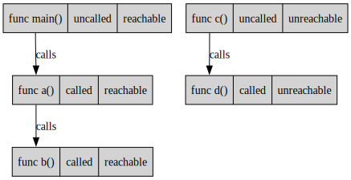
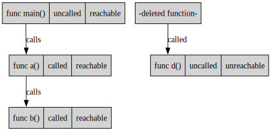

All uncalled functions are unreachable.\
Not all unreachable functions are uncalled.

But by **iteratively removing uncalled** functions \
you should eventually reach a point where all unreachable \
functions have been removed.\
Because removing uncalled functions can potentially make \
other functions uncalled.

#### removing uncalled functions

